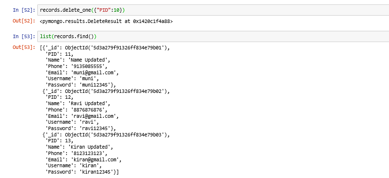

# mongoDB-CRUD
This repository contains mongoDB CRUD operations with Python

MongoDB Atlas NoSQL Database Access
a. Create a Mongo DB Atlas account
b. Create a cluster and Load some sample data
c. Load the JSON code you created in homework 2 into MongoDB
d. Using any programming langue to create an application to connect the Mongo Atlas account
e.  Show MongoDB CRUD Operations with sample data in your code

Step1: Created a Mongo DB Atlas account on cloud:

Step2: Created cluster and loaded sample data as below:

Step3:Created database called ‘ucmo’ and created collection ‘patients_sample’ and loaded sample data which is created in assignment 2 via shell.

Loaded sample data from patients_sample collection showing on cloud mongo (GUI)

Step4:
4.1. Install Python3.7 (via Anaconda3), pymongo19.0,
Python is the programming language which will be installed on the machine and on top of that different IDEs and packages can be installed. Anaconda installs IDEs and several important packages like NumPy, Pandas, and so on, and this is a really convenient package. I am using jupyter here.

4.2. Create database and collection on mongoDB atlas

4.3. Connect to mongoDB database via python(using connection string from mongoDB atlas)

Connecting to mongoDB using above connection string from python:

Step5: MongoDB CRUD Operations with sample data:
5.1. Insert documents into patients collection
  5.1.1 Insert single document into patients collection as shown below:
  Code executing from python:

  5.1.2. Insert multiple documents into patients collection as shown below:
  Code executing from python:
  
  
  
  
    Output on mongoDB atlas:
   
   
  5.2. listing documents from patients collection.
  5.2.1 Find all documents from patients collection

  5.2.2. Find single document from patients collection
  
  
  
  5.3. Update documents from patients collection
  5.3.1. Update single document from patients collection

  
  
    5.3.2. Update multiple documents from patients collection
    
    
    
    Output from mongoDB atlas:
  
    
    
    5.4. Delete documents from patients collection
  5.4.1. Delete single document from patients collection
  Code executing from python:

    
    
      5.4.2. Delete multiple document from patients collection
      
      

